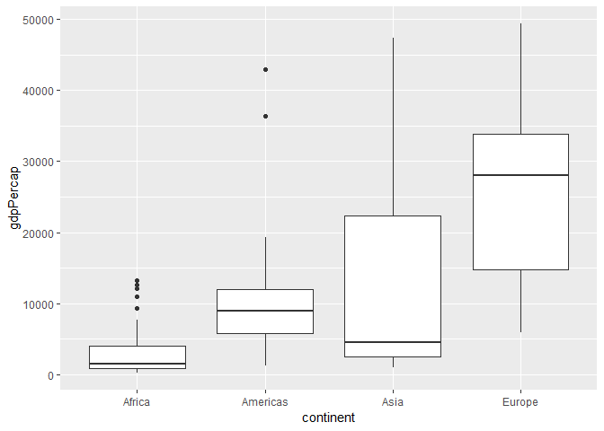

Homework 05: Factor and figure management
================
Coni
October 16, 2018

-   [Homework 05: Factor and figure management](#homework-05-factor-and-figure-management)
    -   [Part 1: Factor management](#part-1-factor-management)
    -   [Part 2: File I/O](#part-2-file-io)
    -   [Part 3: Visualization design](#part-3-visualization-design)
    -   [Part 4: Writing figures to file](#part-4-writing-figures-to-file)

Homework 05: Factor and figure management
=========================================

Load required libraries

``` r
library(gapminder)
library(tidyverse)
library(forcats)
library(gridExtra)
```

Part 1: Factor management
-------------------------

First check the structure of the data set and ensure there are variables which are **factors**

``` r
str(gapminder)
```

    ## Classes 'tbl_df', 'tbl' and 'data.frame':    1704 obs. of  6 variables:
    ##  $ country  : Factor w/ 142 levels "Afghanistan",..: 1 1 1 1 1 1 1 1 1 1 ...
    ##  $ continent: Factor w/ 5 levels "Africa","Americas",..: 3 3 3 3 3 3 3 3 3 3 ...
    ##  $ year     : int  1952 1957 1962 1967 1972 1977 1982 1987 1992 1997 ...
    ##  $ lifeExp  : num  28.8 30.3 32 34 36.1 ...
    ##  $ pop      : int  8425333 9240934 10267083 11537966 13079460 14880372 12881816 13867957 16317921 22227415 ...
    ##  $ gdpPercap: num  779 821 853 836 740 ...

We can see that indeed the variables `country` and `continent` are factors

1.  Drop factor / levels;

**Drop Oceania.** Filter the Gapminder data to remove observations associated with the continent of Oceania. Additionally, remove unused factor levels. Provide concrete information on the data before and after removing these rows and Oceania; address the number of rows and the levels of the affected factors.

Let's filter the data first

``` r
(gapminder_notOceania <- gapminder %>% 
  filter(continent != "Oceania"))
```

    ## # A tibble: 1,680 x 6
    ##    country     continent  year lifeExp      pop gdpPercap
    ##    <fct>       <fct>     <int>   <dbl>    <int>     <dbl>
    ##  1 Afghanistan Asia       1952    28.8  8425333      779.
    ##  2 Afghanistan Asia       1957    30.3  9240934      821.
    ##  3 Afghanistan Asia       1962    32.0 10267083      853.
    ##  4 Afghanistan Asia       1967    34.0 11537966      836.
    ##  5 Afghanistan Asia       1972    36.1 13079460      740.
    ##  6 Afghanistan Asia       1977    38.4 14880372      786.
    ##  7 Afghanistan Asia       1982    39.9 12881816      978.
    ##  8 Afghanistan Asia       1987    40.8 13867957      852.
    ##  9 Afghanistan Asia       1992    41.7 16317921      649.
    ## 10 Afghanistan Asia       1997    41.8 22227415      635.
    ## # ... with 1,670 more rows

And investigate it's structure

``` r
str(gapminder_notOceania) 
```

    ## Classes 'tbl_df', 'tbl' and 'data.frame':    1680 obs. of  6 variables:
    ##  $ country  : Factor w/ 142 levels "Afghanistan",..: 1 1 1 1 1 1 1 1 1 1 ...
    ##  $ continent: Factor w/ 5 levels "Africa","Americas",..: 3 3 3 3 3 3 3 3 3 3 ...
    ##  $ year     : int  1952 1957 1962 1967 1972 1977 1982 1987 1992 1997 ...
    ##  $ lifeExp  : num  28.8 30.3 32 34 36.1 ...
    ##  $ pop      : int  8425333 9240934 10267083 11537966 13079460 14880372 12881816 13867957 16317921 22227415 ...
    ##  $ gdpPercap: num  779 821 853 836 740 ...

``` r
levels(gapminder_notOceania$continent)
```

    ## [1] "Africa"   "Americas" "Asia"     "Europe"   "Oceania"

``` r
nlevels(gapminder_notOceania$continent)
```

    ## [1] 5

We can see from looking at the structure that `Oceania` is still a level of the `continent` factor, and the number of levels in `contient` is still 5, but because `gapminder_notOceania` has fewer observations (1680 rows) than the unmodified `gapminder` (1704 rows), we can see that we effectively filtered out all the cuntries in Oceania

Let's confirm this with a plot:

``` r
ggplot(gapminder_notOceania, aes(continent)) +
  geom_bar() +
  scale_x_discrete(drop=FALSE) #to prevent ggplot from dropping the unused factors automatically
```


Now let's drop the unused levels

``` r
gapminder_notOceania %>%
  droplevels() %>%
  str()
```

    ## Classes 'tbl_df', 'tbl' and 'data.frame':    1680 obs. of  6 variables:
    ##  $ country  : Factor w/ 140 levels "Afghanistan",..: 1 1 1 1 1 1 1 1 1 1 ...
    ##  $ continent: Factor w/ 4 levels "Africa","Americas",..: 3 3 3 3 3 3 3 3 3 3 ...
    ##  $ year     : int  1952 1957 1962 1967 1972 1977 1982 1987 1992 1997 ...
    ##  $ lifeExp  : num  28.8 30.3 32 34 36.1 ...
    ##  $ pop      : int  8425333 9240934 10267083 11537966 13079460 14880372 12881816 13867957 16317921 22227415 ...
    ##  $ gdpPercap: num  779 821 853 836 740 ...

Now we see that the variable `continent` has only 4 levels.

1.  Reorder levels based on knowledge from data.

**Reorder the levels of country or continent.** Use the forcats package to change the order of the factor levels, based on a principled summary of one of the quantitative variables. Consider experimenting with a summary statistic beyond the most basic choice of the median.

Let's filter the data for just the year 2007, and reorder the plot

``` r
gapminder_notOceania %>%
  filter(year == 2007) %>%
  mutate(continent = fct_reorder(continent,gdpPercap)) %>% #reorder according to the median, increasing
  ggplot(aes(continent, gdpPercap)) +
  geom_boxplot(aes())
```


Now let's try reordering according to the mean

``` r
gapminder_NO <- gapminder_notOceania %>%
  filter(year == 2007) %>%
  mutate(continent = fct_reorder(continent,gdpPercap, mean)) %>% #reorder according to the mean, increasing
  ggplot(aes(continent, gdpPercap)) +
  geom_boxplot(aes()) 

gapminder_NO
```



1.  Explore the effects of arrange(). Does merely arranging the data have any effect on, say, a figure?

First, plot `gdpPercap` for each country without any particular order (alphabetical by default)

``` r
gapminder %>%
  filter(year == 2007) %>%
  ggplot(aes(x = gdpPercap , y = country)) + 
  geom_point()
```


Let's try `arrange()`

``` r
arranged_gapminder <- gapminder %>%
  filter(year == 2007) %>%
  arrange(gdpPercap)

ggplot(arranged_gapminder, aes(x = gdpPercap , y = country)) +
  geom_point()
```


When only using `arrange()` and saving to the object it doesn't seem to make any difference for the plot. Let's inspect this object:

``` r
arranged_gapminder %>%
  head(30) %>%
  knitr::kable()
```

| country                  | continent |  year|  lifeExp|        pop|  gdpPercap|
|:-------------------------|:----------|-----:|--------:|----------:|----------:|
| Congo, Dem. Rep.         | Africa    |  2007|   46.462|   64606759|   277.5519|
| Liberia                  | Africa    |  2007|   45.678|    3193942|   414.5073|
| Burundi                  | Africa    |  2007|   49.580|    8390505|   430.0707|
| Zimbabwe                 | Africa    |  2007|   43.487|   12311143|   469.7093|
| Guinea-Bissau            | Africa    |  2007|   46.388|    1472041|   579.2317|
| Niger                    | Africa    |  2007|   56.867|   12894865|   619.6769|
| Eritrea                  | Africa    |  2007|   58.040|    4906585|   641.3695|
| Ethiopia                 | Africa    |  2007|   52.947|   76511887|   690.8056|
| Central African Republic | Africa    |  2007|   44.741|    4369038|   706.0165|
| Gambia                   | Africa    |  2007|   59.448|    1688359|   752.7497|
| Malawi                   | Africa    |  2007|   48.303|   13327079|   759.3499|
| Mozambique               | Africa    |  2007|   42.082|   19951656|   823.6856|
| Sierra Leone             | Africa    |  2007|   42.568|    6144562|   862.5408|
| Rwanda                   | Africa    |  2007|   46.242|    8860588|   863.0885|
| Togo                     | Africa    |  2007|   58.420|    5701579|   882.9699|
| Somalia                  | Africa    |  2007|   48.159|    9118773|   926.1411|
| Guinea                   | Africa    |  2007|   56.007|    9947814|   942.6542|
| Myanmar                  | Asia      |  2007|   62.069|   47761980|   944.0000|
| Afghanistan              | Asia      |  2007|   43.828|   31889923|   974.5803|
| Comoros                  | Africa    |  2007|   65.152|     710960|   986.1479|
| Mali                     | Africa    |  2007|   54.467|   12031795|  1042.5816|
| Madagascar               | Africa    |  2007|   59.443|   19167654|  1044.7701|
| Uganda                   | Africa    |  2007|   51.542|   29170398|  1056.3801|
| Nepal                    | Asia      |  2007|   63.785|   28901790|  1091.3598|
| Tanzania                 | Africa    |  2007|   52.517|   38139640|  1107.4822|
| Haiti                    | Americas  |  2007|   60.916|    8502814|  1201.6372|
| Burkina Faso             | Africa    |  2007|   52.295|   14326203|  1217.0330|
| Zambia                   | Africa    |  2007|   42.384|   11746035|  1271.2116|
| Ghana                    | Africa    |  2007|   60.022|   22873338|  1327.6089|
| Bangladesh               | Asia      |  2007|   64.062|  150448339|  1391.2538|

We see that `arrange()`does arrange the items in the order we wanted, it's just that when plotting this order is not preserved.

1.  Explore the effects of reordering a factor and factor reordering coupled with arrange(). Especially, what effect does this have on a figure?

Let's now use `fct_reorder()` to sort the countries by ascending `gdpPercap`

``` r
reordered_gapminder <- gapminder %>%
  filter(year == 2007) %>%
  mutate(country = fct_reorder(country, gdpPercap))
  
ggplot(reordered_gapminder, aes(x = gdpPercap , y = country)) +
  geom_point()
```


After reordering the countries according to `gdpPercap` the figure plots the sorted countries. Let's have a look at the actual data now

``` r
reordered_gapminder %>%
  head(30) %>%
  knitr::kable()
```

| country                  | continent |  year|  lifeExp|         pop|   gdpPercap|
|:-------------------------|:----------|-----:|--------:|-----------:|-----------:|
| Afghanistan              | Asia      |  2007|   43.828|    31889923|    974.5803|
| Albania                  | Europe    |  2007|   76.423|     3600523|   5937.0295|
| Algeria                  | Africa    |  2007|   72.301|    33333216|   6223.3675|
| Angola                   | Africa    |  2007|   42.731|    12420476|   4797.2313|
| Argentina                | Americas  |  2007|   75.320|    40301927|  12779.3796|
| Australia                | Oceania   |  2007|   81.235|    20434176|  34435.3674|
| Austria                  | Europe    |  2007|   79.829|     8199783|  36126.4927|
| Bahrain                  | Asia      |  2007|   75.635|      708573|  29796.0483|
| Bangladesh               | Asia      |  2007|   64.062|   150448339|   1391.2538|
| Belgium                  | Europe    |  2007|   79.441|    10392226|  33692.6051|
| Benin                    | Africa    |  2007|   56.728|     8078314|   1441.2849|
| Bolivia                  | Americas  |  2007|   65.554|     9119152|   3822.1371|
| Bosnia and Herzegovina   | Europe    |  2007|   74.852|     4552198|   7446.2988|
| Botswana                 | Africa    |  2007|   50.728|     1639131|  12569.8518|
| Brazil                   | Americas  |  2007|   72.390|   190010647|   9065.8008|
| Bulgaria                 | Europe    |  2007|   73.005|     7322858|  10680.7928|
| Burkina Faso             | Africa    |  2007|   52.295|    14326203|   1217.0330|
| Burundi                  | Africa    |  2007|   49.580|     8390505|    430.0707|
| Cambodia                 | Asia      |  2007|   59.723|    14131858|   1713.7787|
| Cameroon                 | Africa    |  2007|   50.430|    17696293|   2042.0952|
| Canada                   | Americas  |  2007|   80.653|    33390141|  36319.2350|
| Central African Republic | Africa    |  2007|   44.741|     4369038|    706.0165|
| Chad                     | Africa    |  2007|   50.651|    10238807|   1704.0637|
| Chile                    | Americas  |  2007|   78.553|    16284741|  13171.6388|
| China                    | Asia      |  2007|   72.961|  1318683096|   4959.1149|
| Colombia                 | Americas  |  2007|   72.889|    44227550|   7006.5804|
| Comoros                  | Africa    |  2007|   65.152|      710960|    986.1479|
| Congo, Dem. Rep.         | Africa    |  2007|   46.462|    64606759|    277.5519|
| Congo, Rep.              | Africa    |  2007|   55.322|     3800610|   3632.5578|
| Costa Rica               | Americas  |  2007|   78.782|     4133884|   9645.0614|

Looking at the table it seems like the actual data has not been sorted.

Now let's couple `fct_reorder()` with `arrange()`

``` r
reordered_arranged_gapminder <- gapminder %>%
  filter(year == 2007) %>%
  mutate(country = fct_reorder(country, gdpPercap)) %>%
  arrange(gdpPercap)
  
ggplot(reordered_arranged_gapminder, aes(x = gdpPercap , y = country)) +
  geom_point()
```


``` r
reordered_arranged_gapminder %>%
  head(30) %>%
  knitr::kable()
```

| country                  | continent |  year|  lifeExp|        pop|  gdpPercap|
|:-------------------------|:----------|-----:|--------:|----------:|----------:|
| Congo, Dem. Rep.         | Africa    |  2007|   46.462|   64606759|   277.5519|
| Liberia                  | Africa    |  2007|   45.678|    3193942|   414.5073|
| Burundi                  | Africa    |  2007|   49.580|    8390505|   430.0707|
| Zimbabwe                 | Africa    |  2007|   43.487|   12311143|   469.7093|
| Guinea-Bissau            | Africa    |  2007|   46.388|    1472041|   579.2317|
| Niger                    | Africa    |  2007|   56.867|   12894865|   619.6769|
| Eritrea                  | Africa    |  2007|   58.040|    4906585|   641.3695|
| Ethiopia                 | Africa    |  2007|   52.947|   76511887|   690.8056|
| Central African Republic | Africa    |  2007|   44.741|    4369038|   706.0165|
| Gambia                   | Africa    |  2007|   59.448|    1688359|   752.7497|
| Malawi                   | Africa    |  2007|   48.303|   13327079|   759.3499|
| Mozambique               | Africa    |  2007|   42.082|   19951656|   823.6856|
| Sierra Leone             | Africa    |  2007|   42.568|    6144562|   862.5408|
| Rwanda                   | Africa    |  2007|   46.242|    8860588|   863.0885|
| Togo                     | Africa    |  2007|   58.420|    5701579|   882.9699|
| Somalia                  | Africa    |  2007|   48.159|    9118773|   926.1411|
| Guinea                   | Africa    |  2007|   56.007|    9947814|   942.6542|
| Myanmar                  | Asia      |  2007|   62.069|   47761980|   944.0000|
| Afghanistan              | Asia      |  2007|   43.828|   31889923|   974.5803|
| Comoros                  | Africa    |  2007|   65.152|     710960|   986.1479|
| Mali                     | Africa    |  2007|   54.467|   12031795|  1042.5816|
| Madagascar               | Africa    |  2007|   59.443|   19167654|  1044.7701|
| Uganda                   | Africa    |  2007|   51.542|   29170398|  1056.3801|
| Nepal                    | Asia      |  2007|   63.785|   28901790|  1091.3598|
| Tanzania                 | Africa    |  2007|   52.517|   38139640|  1107.4822|
| Haiti                    | Americas  |  2007|   60.916|    8502814|  1201.6372|
| Burkina Faso             | Africa    |  2007|   52.295|   14326203|  1217.0330|
| Zambia                   | Africa    |  2007|   42.384|   11746035|  1271.2116|
| Ghana                    | Africa    |  2007|   60.022|   22873338|  1327.6089|
| Bangladesh               | Asia      |  2007|   64.062|  150448339|  1391.2538|

Using both functions seems to work for the actual data too (not only the figure).

Part 2: File I/O
----------------

Experiment with one or more of write\_csv()/read\_csv() (and/or TSV friends), saveRDS()/readRDS(), dput()/dget(). Create something new, probably by filtering or grouped-summarization of Singer or Gapminder. I highly recommend you fiddle with the factor levels, i.e. make them non-alphabetical (see previous section). Explore whether this survives the round trip of writing to file then reading back in.

Let's save the `reordered_arranged_gapminder` dataset in a new `.csv` file.

``` r
write_csv(reordered_arranged_gapminder, "RA_gapminder.csv")
```

Let's read it now

``` r
RA_gapminder <- read_csv("RA_gapminder.csv")
```

    ## Parsed with column specification:
    ## cols(
    ##   country = col_character(),
    ##   continent = col_character(),
    ##   year = col_integer(),
    ##   lifeExp = col_double(),
    ##   pop = col_integer(),
    ##   gdpPercap = col_double()
    ## )

``` r
head(RA_gapminder, 30) %>%
  knitr::kable()
```

| country                  | continent |  year|  lifeExp|        pop|  gdpPercap|
|:-------------------------|:----------|-----:|--------:|----------:|----------:|
| Congo, Dem. Rep.         | Africa    |  2007|   46.462|   64606759|   277.5519|
| Liberia                  | Africa    |  2007|   45.678|    3193942|   414.5073|
| Burundi                  | Africa    |  2007|   49.580|    8390505|   430.0707|
| Zimbabwe                 | Africa    |  2007|   43.487|   12311143|   469.7093|
| Guinea-Bissau            | Africa    |  2007|   46.388|    1472041|   579.2317|
| Niger                    | Africa    |  2007|   56.867|   12894865|   619.6769|
| Eritrea                  | Africa    |  2007|   58.040|    4906585|   641.3695|
| Ethiopia                 | Africa    |  2007|   52.947|   76511887|   690.8056|
| Central African Republic | Africa    |  2007|   44.741|    4369038|   706.0165|
| Gambia                   | Africa    |  2007|   59.448|    1688359|   752.7497|
| Malawi                   | Africa    |  2007|   48.303|   13327079|   759.3499|
| Mozambique               | Africa    |  2007|   42.082|   19951656|   823.6856|
| Sierra Leone             | Africa    |  2007|   42.568|    6144562|   862.5408|
| Rwanda                   | Africa    |  2007|   46.242|    8860588|   863.0885|
| Togo                     | Africa    |  2007|   58.420|    5701579|   882.9699|
| Somalia                  | Africa    |  2007|   48.159|    9118773|   926.1411|
| Guinea                   | Africa    |  2007|   56.007|    9947814|   942.6542|
| Myanmar                  | Asia      |  2007|   62.069|   47761980|   944.0000|
| Afghanistan              | Asia      |  2007|   43.828|   31889923|   974.5803|
| Comoros                  | Africa    |  2007|   65.152|     710960|   986.1479|
| Mali                     | Africa    |  2007|   54.467|   12031795|  1042.5816|
| Madagascar               | Africa    |  2007|   59.443|   19167654|  1044.7701|
| Uganda                   | Africa    |  2007|   51.542|   29170398|  1056.3801|
| Nepal                    | Asia      |  2007|   63.785|   28901790|  1091.3598|
| Tanzania                 | Africa    |  2007|   52.517|   38139640|  1107.4822|
| Haiti                    | Americas  |  2007|   60.916|    8502814|  1201.6372|
| Burkina Faso             | Africa    |  2007|   52.295|   14326203|  1217.0330|
| Zambia                   | Africa    |  2007|   42.384|   11746035|  1271.2116|
| Ghana                    | Africa    |  2007|   60.022|   22873338|  1327.6089|
| Bangladesh               | Asia      |  2007|   64.062|  150448339|  1391.2538|

Part 3: Visualization design
----------------------------

Remake at least one figure or create a new one, in light of something you learned in the recent class meetings about visualization design and color. Maybe juxtapose your first attempt and what you obtained after some time spent working on it. Reflect on the differences. If using Gapminder, you can use the country or continent color scheme that ships with Gapminder. Consult the dimensions listed in All the Graph Things.

``` r
gapminder_NO2 <- gapminder_notOceania %>% #save into new object
  filter(year == 2007) %>%
  mutate(continent = fct_reorder(continent,gdpPercap, mean)) %>% #reorder according to the mean, increasing
  ggplot(aes(continent, gdpPercap)) +
  geom_jitter(aes(color = continent), alpha = 0.2) +
  geom_boxplot(aes(color = continent)) +
  scale_y_log10(breaks = 10^(1:6)) +
  theme_minimal() +
  theme(legend.position="none")

compare_plots <- grid.arrange(gapminder_NO, gapminder_NO2, ncol = 2)
```


``` r
compare_plots
```

    ## TableGrob (1 x 2) "arrange": 2 grobs
    ##   z     cells    name           grob
    ## 1 1 (1-1,1-1) arrange gtable[layout]
    ## 2 2 (1-1,2-2) arrange gtable[layout]

Then, make a new graph by converting this visual (or another, if you’d like) to a plotly graph. What are some things that plotly makes possible, that are not possible with a regular ggplot2 graph?

Part 4: Writing figures to file
-------------------------------

Use ggsave() to explicitly save a plot to file. Then use `` to load and embed it in your report. You can play around with various options, such as:

-   Arguments of ggsave(), such as width, height, resolution or text scaling.
-   Various graphics devices, e.g. a vector vs. raster format.
-   Explicit provision of the plot object p via ggsave(..., plot = p). - Show a situation in which this actually matters.

Let's save the comparison plot into a file

``` r
ggsave("compare_plots.png", compare_plots, width = 10, height = 7)
```

And call it to embed it to the report [like this](C:/Users/const/ownCloud/UBC%20Courses/5%20Term%201%202018/STAT545A/git_docs/hw05-cbnicolau/compare_plots.png)
